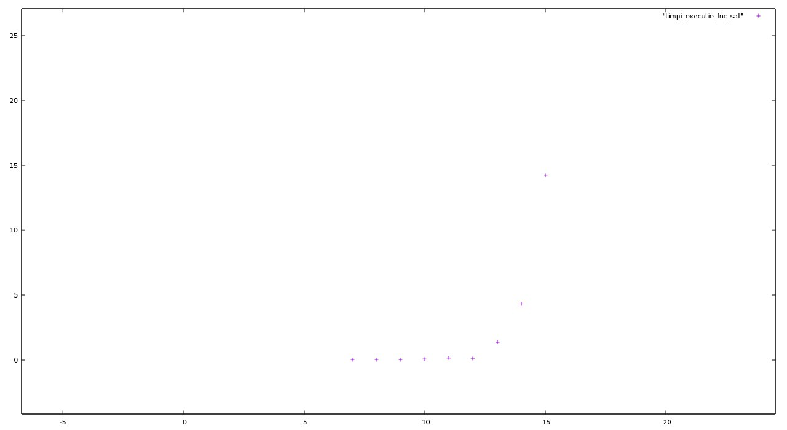

# SAT - Solver  
# THE MATRIX REPRESENTATION OF THE CNF FORMULA

## The Importance

• **SAT** was the first problem discovered to be NP-complete, thanks to the Cook-Levin theorem.
  As a result, it was studied for a long time, discovering many heuristic algorithms that can find (most often) valid configurations in polynomial time,despite the fact that it is not yet known whether or not there is an exact algorithm that solves SAT in polynomial time.

• These **solvers** are very very useful for many other problems for which, in the same way, that no effective solutions have been formulated-usually also NP-Complete Problems , because we can reduce them polynomially to **SAT** .

## Objective

• The objective was to implement in Python an algorithm for solving the Boolean Satisfiability Problem , more exactly the SAT problem, determining the execution times for them and creating a simple graph to illustrate the complexity of the algorithm.

## The Algorithm CNF - SAT

- The algorithm uses the Matrix form to represent a formula.
- In the matrix , the **rows** correspond to **the clauses in the formula**, and **the columns** to **the variables** .

- Each variable can be:
  (i)   not appear in a clause,
  (ii)  appear without denial,
  (iii) appear negative.
 
## Mention

To find an interpretation, the algorithm will have a "backtracking" approach over all possible interpretations.

## The Implementation

• In this project, I implemented the following functions :

### ***Part 1***

- ***def solve (fnc)*** -> which receives as a parameter the formula in natural conjunctive form, and in this function we first create a list of literals.

• Then we search iteratively through the formula in the natural conjunctive form if there is a literal negated m and if there is, we will replace it with '', and at the same time we separate by the character V.

• Then we iterate again with the variable j in the clause, adding the clause to the list of literals, and if there is a duplicate, we delete them using set (literals).

• We create the matrix as a list in which we add another list and initialize it all with 0 and iterate again through the formula from fnc and when we meet in V, we separate the formula, and if we find in the matrix the element ~, we replace it with '' and we put -1 in the clause, and if we do not find in the formula from fnc any negative element ~, we put 1.

• Then we go through the indexes of the iteration list and consider the interpretation True.

• We go through iteratively with variables in the matrix, if we consider that clause is false.

• If in the matrix we find on positions i, j the element 1 and in the list of iterations the same or in the matrix we find -1 and in the list of iterations 0, then we found an element true in a clause, it results that all our clause will be True .

• If a clause in an expression is false, then the whole interpretation is False and we stop.

• If the interpreter is True, we display 1.

• If the interpreter is False, we display 0.

### ***Part 2***

- ***def interare (nr_element, literals)*** -> which receives as parameter the number of elements, and literals, and this function performs the exhaustive search over all interpretations.

### ***Part 3***

- ***def sat_solver_algorithm ()***

  • In this function we read the respective formula in the input
  
  • Put in fnc the read input in which we replace the parentheses with '' and divide after the input.
  
  • Call the solve function (fnc)
  
### The Graph Times
• We can see from the graph that when the execution times were plotted, and what we want to observe from this graph is how the time required to find an interpretation increases ***(exponentially)*** as the number of variables increases.

  
